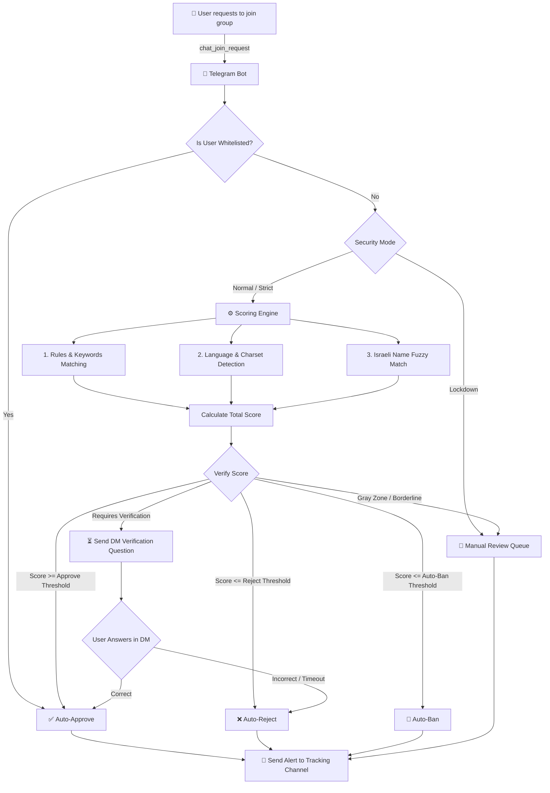

# 🛡️ Telegram Join Request Moderation System

[](https://www.python.org/)
[](https://github.com/aiogram/aiogram)
[](https://sqlite.org/)
[](https://www.docker.com/)

A production-ready, fully async, high-performance Telegram group moderation platform. It processes, scores, and filters join requests automatically using a multi-layered rule engine and interactive verification challenges. 

> [!IMPORTANT]
> **100% Telegram-Native:** This system is administered entirely within Telegram using secure commands, interactive inline menus, and finite-state-machine (FSM) configurations. No web dashboard or API exposure required.

---

## 🗺️ System Workflow



---

## ⚙️ Features & Configurable Variables

The system is configured on a per-group basis using the `/settings` command. The main configurable parameters and logic layers include:

### 🛡️ Security Modes (`security_mode`)
- **`normal` (Normal):** The bot automatically decides whether to approve, reject, ban, or send to verification based on the user's score.
- **`strict` (Strict):** Bypasses instant auto-approval. Forces all new join requests to solve a verification question first.
- **`lockdown` (Lockdown):** Halts automatic entry. All join requests are sent directly to the manual review queue.

### 📊 Decision Thresholds
- **`approve_threshold` (Default: `60`):** Score required to automatically approve the user's join request.
- **`reject_threshold` (Default: `0`):** Users with scores at or below this limit are automatically rejected.
- **`auto_ban_threshold` (Default: `-100`):** Users with scores at or below this limit are automatically banned and rejected.
- **`manual_review_range` (`manual_review_range_min` to `manual_review_range_max`):** Scores within this range (default `30`–`60`) trigger a manual review request sent to administrators.

### 🌐 Language & Charset Filters (`group_language_filters`)
Detects specific alphabet character sets in the user's name and applies customized score adjustments:
- **Hebrew (`[֐-׿]`):** Default score weight `+70`
- **Arabic (`[؀-ۿ]`):** Default score weight `-60`
- **Persian (`[؀-ۿﭐ-﷿ﹰ-]`):** Default score weight `+30`
- **Russian (`[Ѐ-ӿ]`):** Default score weight `+10`
- **Turkish (`[ğüşıöçĞÜŞİÖÇ]`):** Default score weight `+5`
- **English (`[a-zA-Z]`):** Default score weight `-10`

### 🔍 Custom Moderation Rules (`group_rules`)
Allows creating matching filters targeting the user's `first_name`, `last_name`, `username`, `full_name`, or `verification_answer`:
- **Matching Types:** Regex matching, Keyword matching, or Exact Match.
- **Dynamic Scores:** Rules can apply positive score bonuses (to verify trust) or negative penalties (for suspicious content).

### 👥 Israeli Name Matching (`fuzzy_match_threshold`)
Compares the user's name against a global list of common Israeli names (`israeli_names`).
- **Fuzzy Match Threshold (Default: `80%`):** Minimal similarity percentage (using rapidfuzz Levenshtein distance) to grant a `+40` score bonus.

### 💬 Verification Challenges (`group_questions`)
Interactive DM challenges sent to users who require validation:
- **FSM Creation:** Configure question text, accepted answers list, maximum allowed attempts, and response timeouts (in seconds) directly inside the DM with the bot.
- **Custom Outcomes:** Define if a failed challenge results in a ban (`ban_on_fail`) and customize scores awarded on pass (`score_on_pass`) or fail (`score_on_fail`).

### 🚫 Blacklist & Whitelist
- **Blacklist:** Keywords that, when found in user names/usernames, penalize the score by a configurable amount (default `-100`).
- **Whitelist:** Explicit Telegram user IDs that are approved instantly, bypassing all filters.

### 🔄 Settings Cloning & Templates
- **Template Group:** Admins can designate any group's configuration as their default template.
- **Import/Clone:** New groups can import all configurations, rules, and questions from another group managed by the same owner with a single tap.

---

## 🔑 Administrator Interfaces

### 1. Group Owner Panel (via `/settings`)
A private interactive dashboard for group admins.
- Toggle language filters on/off.
- View stats (Approved, Rejected, Banned, Pending counts).
- Set decision thresholds using `/threshold <key> <value>`.
- Manage rules, questions, blacklist, and whitelist via inline menus.
- Clone and import settings from other groups.

### 2. Global Super-Admin Panel (via `/admin`)
Restricted to the `SUPER_ADMIN_ID` for platform-wide oversight.
- **System Overview:** View total active groups and overall approval rates.
- **Group Management:** Deactivate, activate, or globally ban/unban groups.
- **Live Logs:** View the last 50 global moderation decisions.
- **User Search:** Search history for specific Telegram IDs across all groups.
- **Broadcast System:** Send announcements directly to all registered group owners.

### 3. Tracking Channel Alerts
If `tracking_channel_id` is defined, the bot sends rich HTML log alerts detailing the decision type, matching rules, user info, and final score calculations.

---

## 🚀 Getting Started

Read the full installation walkthrough in [SETUP.md](SETUP.md).

### 1. Requirements
- Python 3.11+
- SQLite or PostgreSQL
- A bot token from [@BotFather](https://t.me/BotFather)

### 2. Quick Launch
```bash
# 1. Install packages
pip install -r requirements.txt

# 2. Set environment configurations
cp .env.example .env
# Edit .env and fill in: BOT_TOKEN, SUPER_ADMIN_ID, TRACKING_CHANNEL_ID, etc.

# 3. Seed initial database values
python setup.py

# 4. Apply schema migrations
alembic upgrade head

# 5. Run the bot
python run_bot.py
```
